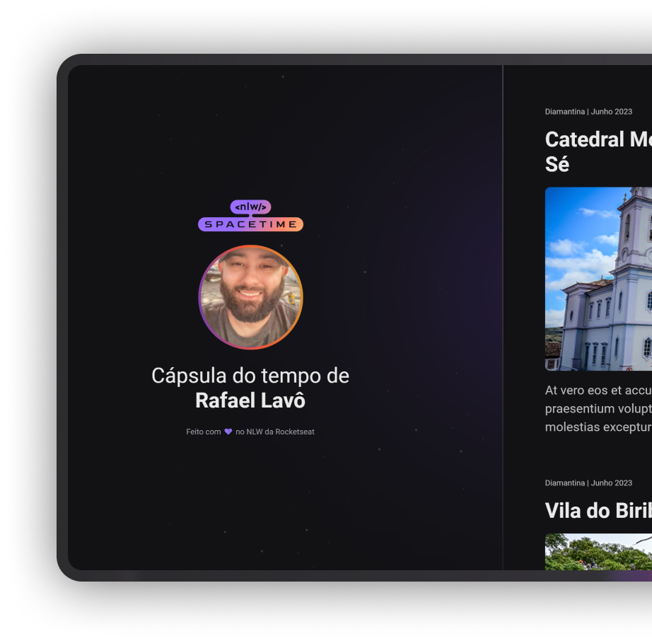

## 🖥️ Projeto
Esse é um projeto web responsivo de uma capsula do tempo para exibir memórias em uma linha do tempo.

## 🚀 Tecnologias
Esse projeto foi desenvolvido durante o NLW da Rocketseat com as seguintes tecnologias:

- HTML;
- CSS;
- Git;
- Github.

## 🏷️ Layout
Você pode vizualizar o layout do projeto por meio [desse link](https://rafalavo.github.io/NLW-SpaceTime/).

